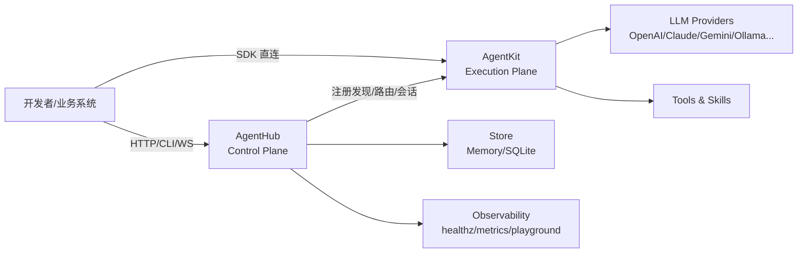

# AgentKit & AgentHub

**面向生产的 Agent 双产品组合：`AgentKit`（执行平面）+ `AgentHub`（管控平面）。**

[](https://www.python.org/downloads/)
[](LICENSE)

## 项目概览

本仓库包含两个可独立使用、也可组合部署的产品：

- **AgentKit**：Python 原生 Agent 开发框架，负责 Agent 构建、工具调用、Skill 生命周期、模型适配与执行编排。
- **AgentHub**：AgentKit 的 Control Plane，负责注册发现、统一网关、会话管理、可观测与平台治理。

当你需要：

- **快速开发单个 Agent 或本地验证**：优先使用 AgentKit。
- **多 Agent 服务化、统一接入与运维治理**：在 AgentKit 之上接入 AgentHub。

## 关系图



## 产品矩阵

| 产品 | 定位 | 适用场景 | 安装 |
|------|------|----------|------|
| **AgentKit** | 执行平面（Execution Plane） | Agent 开发、工具与 Skill 编排、多模型推理 | `pip install ni.agentkit` |
| **AgentHub** | 管控平面（Control Plane） | Agent 注册发布、统一调用网关、会话与观测 | `pip install ni.agenthub` |

## 文档导航

### AgentKit 文档

- [概述](agentkit/docs/README.md)
- [快速开始（16 个示例）](agentkit/docs/QuickStart.md)
- [架构设计](agentkit/docs/Architecture.md)
- [API 参考](agentkit/docs/Reference.md)
- [示例目录（standard）](agentkit/examples/standard/README.md)
- [示例目录（ollama）](agentkit/examples/ollama/README.md)

### AgentHub 文档

- [概述](agenthub/docs/README.md)
- [快速开始（启动、注册、调用、回放）](agenthub/docs/QuickStart.md)
- [架构设计](agenthub/docs/Architecture.md)
- [API/CLI/配置参考](agenthub/docs/Reference.md)
- [Agent 清单模板 `agent.yaml`](agenthub/docs/agent.yaml.example)

## 快速开始

### 1. AgentKit（构建并运行 Agent）

```bash
pip install ni.agentkit
```

```python
from agentkit import Agent, Runner

agent = Agent(
    name="assistant",
    instructions="你是一个有帮助的中文助手。",
    model="ollama/qwen3.5:cloud",
)

result = Runner.run_sync(agent, input="你好，介绍一下你自己")
print(result.final_output)
```

更多能力（工具、Skill、多 Agent、记忆、安全）：见 [AgentKit QuickStart](agentkit/docs/QuickStart.md)。

### 2. AgentHub（服务化与统一网关）

```bash
pip install ni.agenthub
agenthub serve --store sqlite --sqlite-path .agenthub/agenthub.db
```

```bash
# 准备清单并注册
cp ./agenthub/docs/agent.yaml.example ./agent.yaml
agenthub register ./agent.yaml --alias stable --alias latest

# 调用
agenthub run demo-echo --input "你好"
```

完整流程（REST/SSE/WS、resume、trace）：见 [AgentHub QuickStart](agenthub/docs/QuickStart.md)。

## 仓库结构

```bash
.
├── agentkit/   # Agent 执行框架
├── agenthub/   # Agent 管控平面
└── README.md   # 当前总览入口
```

## 构建与发布

```bash
# 构建 AgentKit
cd agentkit && ./build.sh all

# 构建 AgentHub
cd agenthub && ./build.sh all
```

各产品详细构建说明请查看对应目录文档与脚本注释。

## License

MIT
