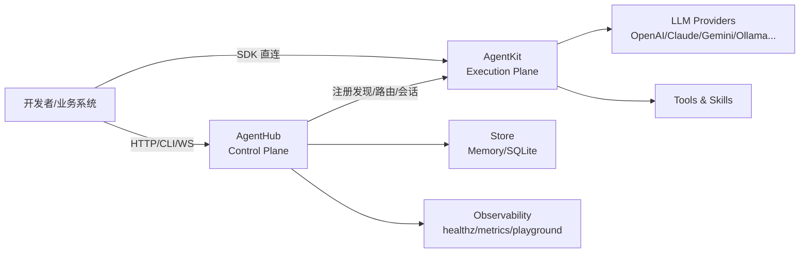

# AgentKit & AgentHub

**面向生产的 Agent 双产品组合：`AgentKit`（执行平面）+ `AgentHub`（管控平面）。**

[](https://www.python.org/downloads/)
[](LICENSE)

## 项目概览

本仓库包含两个可独立使用、也可组合部署的产品：

- **AgentKit**：Python 原生 Agent 开发框架，负责 Agent 构建、工具调用、Skill 生命周期、模型适配与执行编排；内置 `SimpleRAGAgent` 与 `HybridRAGAgent` 两条 RAG 路线。
- **AgentHub**：AgentKit 的 Control Plane，负责注册发现、统一网关、会话管理、可观测与平台治理；支持 REST / SSE / WebSocket、`tenant:user` 维度配额和结构化审计日志。

当你需要：

- **快速开发单个 Agent 或本地验证**：优先使用 AgentKit。
- **多 Agent 服务化、统一接入与运维治理**：在 AgentKit 之上接入 AgentHub。

## 关系图


```mermaid
flowchart LR
    U[开发者/业务系统] -->|SDK 直连| K[AgentKit\nExecution Plane]
    U -->|HTTP/CLI/WS| H[AgentHub\nControl Plane]
    H -->|注册发现/路由/会话| K

    K --> M[LLM Providers\nOpenAI/Claude/Gemini/Ollama...]
    K --> T[Tools & Skills]
    H --> S[Store\nMemory/SQLite]
    H --> O[Observability\nhealthz/metrics/playground]
```

## 产品矩阵

| 产品 | 定位 | 适用场景 | 安装 |
|------|------|----------|------|
| **AgentKit** | 执行平面（Execution Plane） | Agent 开发、工具与 Skill 编排、多模型推理、轻量/混合 RAG | `pip install ni.agentkit` |
| **AgentHub** | 管控平面（Control Plane） | Agent 注册发布、统一调用网关、会话管理、观测、鉴权与配额 | `pip install ni.agenthub` |

## 文档导航

### AgentKit 文档

- [概述](agentkit/docs/README.md)
- [快速开始（18 组主线示例 + 扩展示例，含 SimpleRAGAgent V1 / HybridRAGAgent V2）](agentkit/docs/QuickStart.md)
- [架构设计](agentkit/docs/Architecture.md)
- [API 参考](agentkit/docs/Reference.md)
- [示例目录（standard）](agentkit/examples/standard/README.md)
- [示例目录（ollama）](agentkit/examples/ollama/README.md)

### AgentHub 文档

- [概述](agenthub/docs/README.md)
- [快速开始（启动、注册、调用、回放，含 HybridRAGAgent 工作目录示例）](agenthub/docs/QuickStart.md)
- [架构设计](agenthub/docs/Architecture.md)
- [API/CLI/配置参考](agenthub/docs/Reference.md)
- [Agent 清单模板 `agent.yaml`](agenthub/docs/agent.yaml.example)

## 快速开始

### 1. AgentKit（构建并运行 Agent）

```bash
pip install ni.agentkit
```

```python
from agentkit import Agent, function_tool

# 1. 定义工具
@function_tool
def calculate(expression: str) -> str:
    """计算数学表达式"""
    return str(eval(expression))

# 2. 创建 Agent
agent = Agent(
    name="assistant",
    instructions="你是一个有帮助的中文助手。需要计算时请使用工具。",
    model="ollama/qwen3.5:cloud",
    tools=[calculate],
)

# 3. 运行
result = agent.invoke(input="你好，介绍一下你自己")
print(result.final_output)
```

AgentKit 还内置两套 RAG 方案：

- `SimpleRAGAgent`：轻量入门版，支持 `txt/md/markdown/pdf` 知识库输入，默认将知识库索引与记忆统一落盘到 `./.agentkit/rag/index.db`
- `HybridRAGAgent`：增强版，默认采用 `BM25 + Chroma 向量检索 + RRF + Reranker`，并将向量库与默认记忆拆分持久化；默认 reranker 指向本地 `agentkit-rerank-server`

如果你想快速体验 `HybridRAGAgent`，推荐直接使用随包提供的工作目录向导：

```bash
pip install "ni.agentkit[rag,rerank]"
agentkit-hybrid-rag-init
cd hybrid-rag-workspace
python start_rerank_server.py
python chat.py
```

向导生成的工作目录默认包含 `.env`、`create_agent.py`、`start_rerank_server.py`、`chat.py` 与 `README.md`；知识库目录既支持默认 `knowledge_base/`，也支持自定义相对路径或绝对路径。

更多能力（工具、Skill、多 Agent、记忆、安全、RAG）：见 [AgentKit 文档概览](agentkit/docs/README.md) 与 [AgentKit QuickStart](agentkit/docs/QuickStart.md)。

### 2. AgentHub（服务化与统一网关）

```bash
pip install ni.agenthub
agenthub --version
agenthub serve --store sqlite --sqlite-path .agenthub/agenthub.db
```

```bash
# 准备清单并注册
cp ./agenthub/docs/agent.yaml.example ./agent.yaml
agenthub register ./agent.yaml --alias stable --alias latest

# 调用
agenthub run demo-echo --input "你好"
```

AgentHub 当前支持：

- `agent.yaml` 注册发现与别名管理
- 同步调用、SSE 流式调用、WebSocket 双向调用
- 会话回放、`resume` 恢复、HITL 工作台
- `tenant:user` 维度并发 / 速率配额，超限返回 `429 quota_exceeded:*`
- 结构化审计日志与 `/healthz`、`/metrics`、`/playground`
- `agenthub chat` 启动基于 Streamlit 的 Chat 页面

完整流程（REST/SSE/WS、resume、trace、chat）：见 [AgentHub QuickStart](agenthub/docs/QuickStart.md)。

## 仓库结构

```bash
.
├── agentkit/   # Agent 执行框架
├── agenthub/   # Agent 管控平面
└── README.md   # 当前总览入口
```

## 构建与发布

```bash
# 构建 AgentKit
cd agentkit && ./build.sh all

# 构建 AgentHub
cd agenthub && ./build.sh all
```

各产品详细构建说明请查看对应目录文档与脚本注释。

## License

MIT
